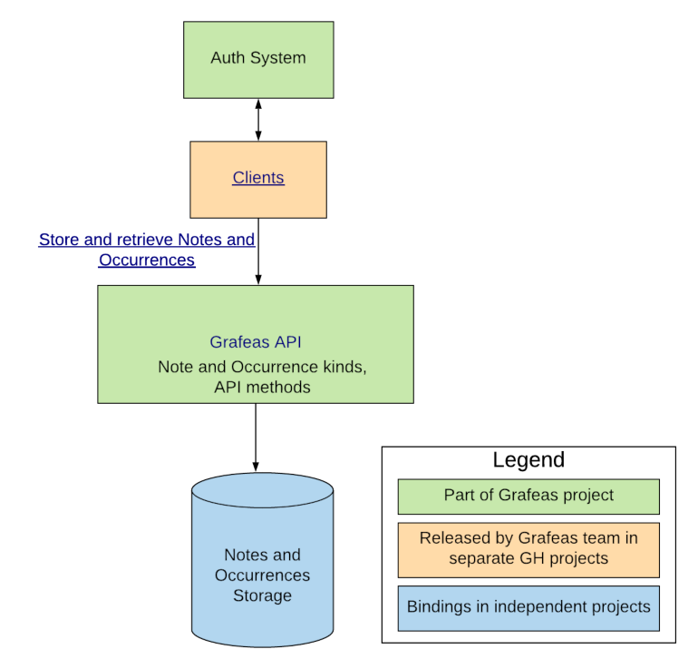

# Grafeas: A Component Metadata API

Grafeas ("scribe" in Greek) is an open-source artifact metadata API that provides a uniform way to audit and govern your software supply chain. Grafeas defines an API spec for managing metadata about software resources, such
as container images, Virtual Machine (VM) images, JAR files, and scripts. You can use Grafeas to define and aggregate information about your project's components. Grafeas provides organizations with a central source of truth for tracking and enforcing policies across an ever growing set of software development teams and pipelines. Build, auditing, and compliance tools can use the Grafeas API to store, query, and retrieve comprehensive metadata on software components of all kinds.

Grafeas divides the metadata information into [_notes_](docs/grafeas_concepts.md#notes) and
[_occurrences_](docs/grafeas_concepts.md#occurrences). Notes are high-level descriptions of particular
types of metadata. Occurrences are instantiations of notes, which describe how
and when a given note occurs on the resource associated with the occurrence.
This division allows third-party metadata providers to create and manage
metadata on behalf of many customers. It also allows for fine-grained access
control of different types of metadata.

## Getting Started

* Watch the talk on [Software Supply Chain Management with Grafeas and Kritis](https://www.infoq.com/presentations/supply-grafeas-kritis/)
* Read the Grafeas [announcement](https://grafeas.io/blog/introducing-grafeas)
* Learn the [Grafeas concepts](docs/grafeas_concepts.md) and [core design
  principles](docs/design_principles.md)
* Run Grafeas locally following [these
instructions](docs/running_grafeas.md)
* Once you have a running server, you can
use the [client libraries](https://github.com/grafeas) to experiment with
creating notes and occurrences in Grafeas. There are client libraries available in Java, Go, Ruby, and Python.
* The authoritative API for grafeas is the [protobuf
files](https://github.com/Grafeas/Grafeas/tree/master/proto/v1beta1).

## Grafeas Architecture

Grafeas project consists of

* the Grafeas API,
* a reference server implementation,
* [3 community contributed storage backends](https://github.com/grafeas/grafeas/tree/master/go/v1beta1/storage):
PostgreSQL, BoltDB, and in-memory storage.

Longer-term, these are to be extracted into separate projects (see
[#341](https://github.com/grafeas/grafeas/issues/341)).

The diagram below shows the boundaries between Grafeas API, server, its storage
backends and the clients:

##  Storage Backends

The following projects provide bindings for Grafeas API to different storage backends:

* [grafeas-pgsql](https://github.com/grafeas/grafeas-pgsql)
* [grafeas-oracle](https://github.com/judavi/grafeas-oracle)
* [grafeas-elasticsearch](https://github.com/rode/grafeas-elasticsearch)

## Roadmap

Please see the [Grafeas roadmap](https://www.slideshare.net/aysylu/binary-authorization-in-kubernetes/65)
for the future of the project development.

## Support

If you have questions, reach out to us on
[grafeas-users](https://groups.google.com/forum/#!forum/grafeas-users). For
questions about contributing, please see the [section](#contributing) below or
use [grafeas-dev](https://groups.google.com/forum/#!forum/grafeas-dev).

Grafeas announcements will be posted to its
[@grafeasio](https://twitter.com/Grafeasio) Twitter account and to
[grafeas-users](https://groups.google.com/forum/#!forum/grafeas-users).

## Contributing

See [CONTRIBUTING](CONTRIBUTING.md) for details on how you can contribute.

See [DEVELOPMENT](DEVELOPMENT.md) for details on the  development and testing workflow.

## License

Grafeas is under the Apache 2.0 license. See the [LICENSE](LICENSE) file for details.
